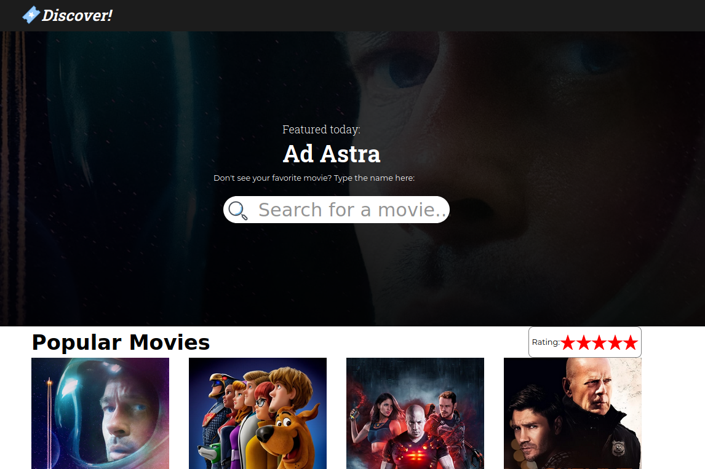
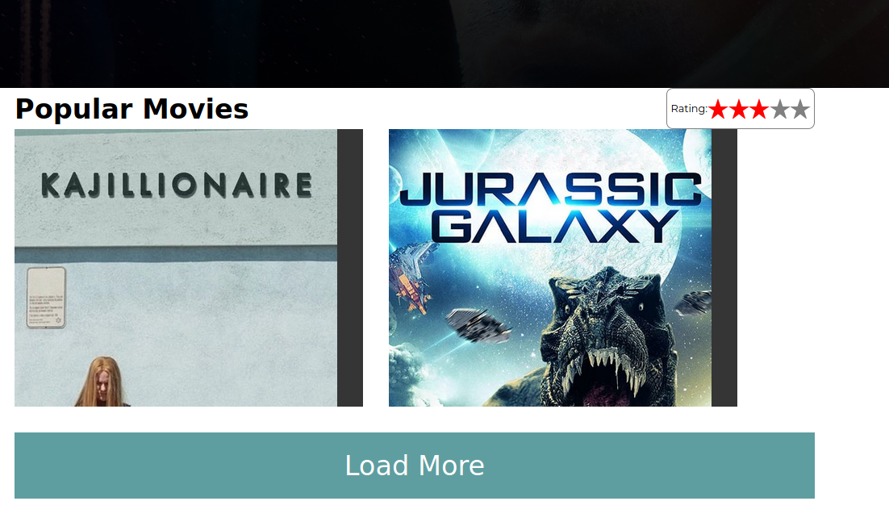
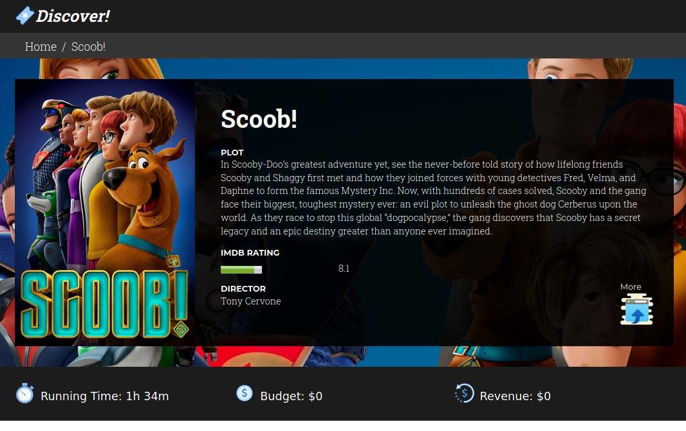
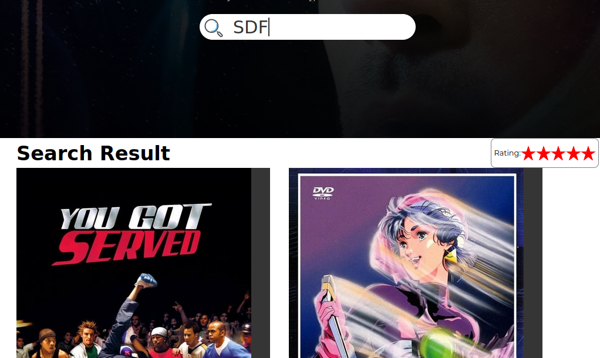

<!-- PROJECT SHIELDS -->
[![Forks][forks-shield]][forks-url]
[![Stargazers][stars-shield]][stars-url]
[![Issues-open][issues-open-shield]][issues-open-url]
[![Issues-closed][issues-closed-shield]][issues-close-url]
[![Contributors][contributors-shield]][contributors-url]
[![contributions welcome][contributions-welcome]][issues-url]

<!-- PROJECT LOGO -->
<br/>
<p align="center">
  <a href="https://github.com/Israel-Laguan/movie-discover/">
    
  </a>

  <h1 align="center">
	Movie Discovery App
  </h1>
  <p align="center">
    <br/>
    <a href="https://github.com/Israel-Laguan/movie-discover/issues">Report a Bug</a>
    🙋‍♂️
    <a href="https://github.com/Israel-Laguan/movie-discover/issues">Request Feature</a>
  </p>
</p>

# [Live Version Here](http://movie-discover.surge.sh/)



## Table of Contents

1. [The Project](#the-project)
2. [Features](#features)
3. [Run It](#run-it)
4. [Author](#author)
5. [Contributing](#contributing)
6. [Show your support](#show-your-support)
7. [License](#license)

# The Project

Your local movie theater is in dire need of attracting new audience. To do this, they're asking you to build a simple web application that allows users to discover new movies and search for them.

The movie theater is requesting the following features for the first version:

- Upon opening the web application, users should be able to see a list of
movies suggested by the application and sorted by popularity.
- In the discovery view, add a search bar at the top to allow users to query
information about movies. If the search field is empty, show the discovery results.
- Add a rating filter in the form of five stars. When selecting a star, all the stars to the left should be selected as well. If the star clicked is the currently active, disable the filter.
- Upon clicking, a detail view must be shown, displaying more information about
the movie.

## Using the App

- Discover the most popular movie at the moment on the front page



- Click on specific movie to view full-blown information



- Use the Search bar to find you favorites movies and their information



- Bookmark and use the App at your own pace!

# Features

![javascript][]
![react][]
[![Framework][badge-framework]][framework-url]
![css][]

- Using Create React App (CRA)
- Redux and Redux Toolkit
- No Style Framework, only pure CSS (Looking at you Bootstrap...)
- Async Fetch
- React-Router
- Mobile Optimized
- Enviromental Variables for API key

# Run It

This project was bootstrapped with [Create React App](https://github.com/facebook/create-react-app), using the [Redux](https://redux.js.org/) and [Redux Toolkit](https://redux-toolkit.js.org/) template.

## Prerequisites

You will need [Node.js](https://nodejs.org) version 8.0 or greater installed on your system.

## Setup

Get the code by either cloning this repository using git

```bash
git clone git@github.com:Israel-Laguan/movie-discover.git
```

... or [downloading source code](git@github.com:Israel-Laguan/movie-discover.git/archive/master.zip) as a zip archive.

Once downloaded, open the terminal in the project directory, and install dependencies with:

```bash
npm install
```

Then start the app with:

```bash
npm start
```

The app should now be up and running at http://localhost:3000 🚀

## Available Scripts

In the project directory, you can run:

### `npm start`

Runs the app in the development mode.<br />
Open [http://localhost:3000](http://localhost:3000) to view it in the browser.

The page will reload if you make edits.<br />
You will also see any lint errors in the console.

### `npm test`

Launches the test runner in the interactive watch mode.<br />
See the section about [running tests](https://facebook.github.io/create-react-app/docs/running-tests) for more information.


# Author

<table style="width:100%">
  <tr>
    <td>
        <div align="center">
            <a href="./docs/img/photo.png" target="_blank" rel="author">
                
            </a>
            <h2>
                <a href="https://israel-laguan.github.io/" target="_blank" rel="author">
                    Israel Laguan
                </a>
            </h2>
        </div>
    </td>
    <td>
        <div align="center">
            <a href="mailto:israellaguan@gmail.com" target="_blank" rel="author">
                
                <h3>
                    Email me to 
                    <a href="mailto:israellaguan@gmail.com">
                        israellaguan@gmail.com
                    </a>
                </h3>
            </a>
            <a href="https://www.linkedin.com/in/israellaguan/" target="_blank" rel="author">
                
                <h3>
                    Connect to my Linkedin
                </h3>
            </a>
            <a href="https://github.com/Israel-Laguan" target="_blank" rel="author">
                
                <h3>
                    Check my GitHub Profile
                </h3>
            </a>
        </div>
    </td>
  </tr>
</table> 

# Contributing

[![contributions welcome][contributions-welcome]][issues-url]

🤝 Contributions, issues and feature requests are welcome!
Feel free to check the [issues page][issues-url].

# Show your support

🤗 Give a ⭐️ if you like this project!

Icons from:

<a href="https://icons8.com/icon/13917/full-image">Icons8</a>
<a target="_blank" href="https://icons8.com/icons/set/starred-ticket">Movie Ticket icon</a> icon by <a target="_blank" href="https://icons8.com">Icons8</a>
Icons made by <a href="https://www.flaticon.com/authors/catkuro" title="catkuro">catkuro</a> from <a href="https://www.flaticon.com/" title="Flaticon"> www.flaticon.com</a>
Banner by https://www.canva.com

Style: [oliver-gomes](https://github.com/oliver-gomes/react-movie)
StarRating: [Here](https://codesandbox.io/s/v0n20v6143)

# License

[![License][badge-license]](http://badges.mit-license.org)

📝 This project is licensed under the [MIT](LICENSE)\
Feel free to fork this project and improve it

<!-- MARKDOWN LINKS & IMAGES -->
[contributors-shield]: https://img.shields.io/github/contributors/Israel-Laguan/movie-discover?style=for-the-badge
[contributors-url]: https://github.com/Israel-Laguan/movie-discover/graphs/contributors
[forks-shield]: https://img.shields.io/github/forks/Israel-Laguan/movie-discover?style=for-the-badge
[forks-url]: https://github.com/Israel-Laguan/movie-discover/network/members
[stars-shield]: https://img.shields.io/github/stars/Israel-Laguan/movie-discover?style=for-the-badge
[stars-url]: https://github.com/Israel-Laguan/movie-discover/stargazers
[issues-open-shield]: https://img.shields.io/github/issues/Israel-Laguan/movie-discover?style=for-the-badge
[issues-url]: https://github.com/Israel-Laguan/movie-discover/issues
[issues-open-url]: https://github.com/Israel-Laguan/movie-discover/issues?q=is%3Aopen+is%3Aissue
[issues-close-url]: https://github.com/Israel-Laguan/movie-discover/issues?q=is%3Aissue+is%3Aclosed
[issues-closed-shield]: https://img.shields.io/github/issues-closed/Israel-Laguan/movie-discover?style=for-the-badge
[badge-framework]: https://img.shields.io/badge/store-Redux-000?style=for-the-badge&logo=redux
[framework-url]: https://redux.js.org/
[contributions-welcome]: https://img.shields.io/badge/contributions-welcome-brightgreen.svg?style=for-the-badge
[badge-license]: https://img.shields.io/:license-mit-blue.svg?style=for-the-badge
[react]: https://img.shields.io/badge/React-16+-61DAFB?style=for-the-badge&logo=react
[javascript]: https://img.shields.io/badge/JAVASCRIPT-ES6%2B-F7DF1E?style=for-the-badge&logo=javascript
[css]: https://img.shields.io/badge/style-CSS-1572B6?style=for-the-badge&logo=css3
